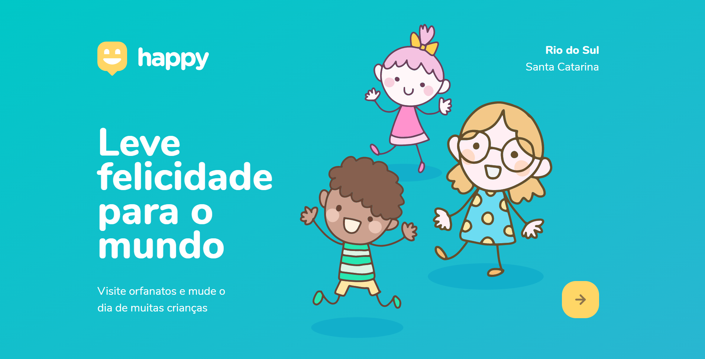

# Projeto Happy da RocketSeat 🚀

*Projeto:*

Uma forma de encontrar lares de adoção que aceitem visitas, sendo assim você pode identificar qual o local mais proximo e agendar visitas para uma dessas crianças, alegrando seus dias. 

## Versão para Desktop

# Happy

*Tecnologias usadas* 💻

- Handlebars (Template Engine)
- HTML5
- CSS3
- JavaScript
- NodeJs
- Express
- SQL
- Figma
